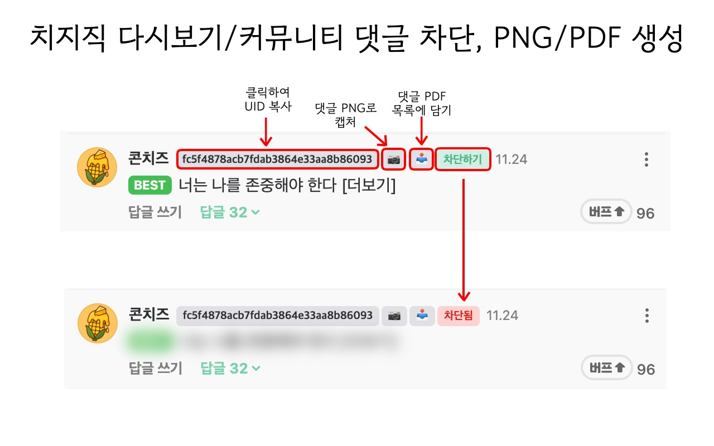
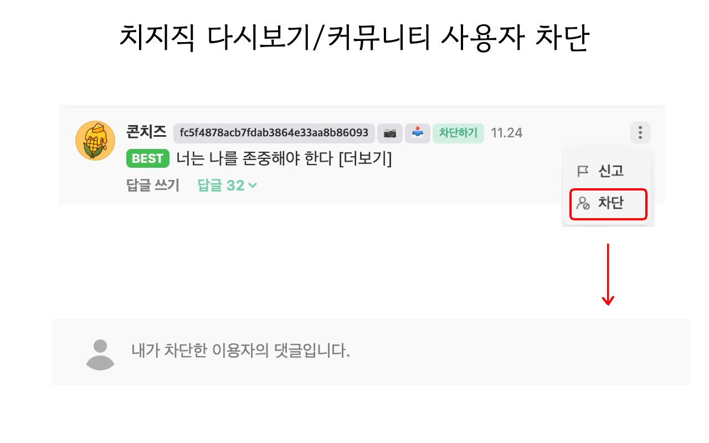
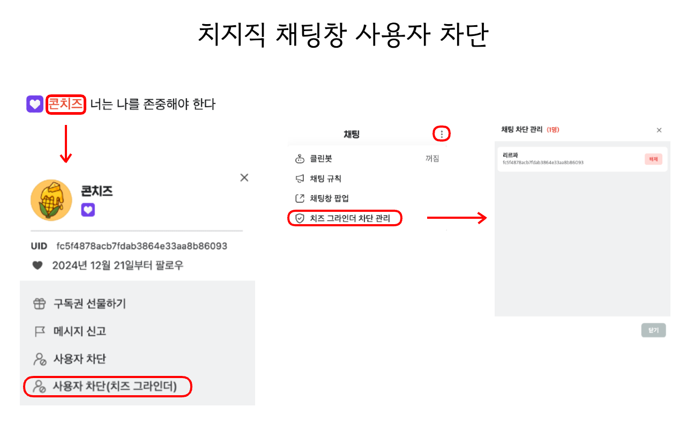
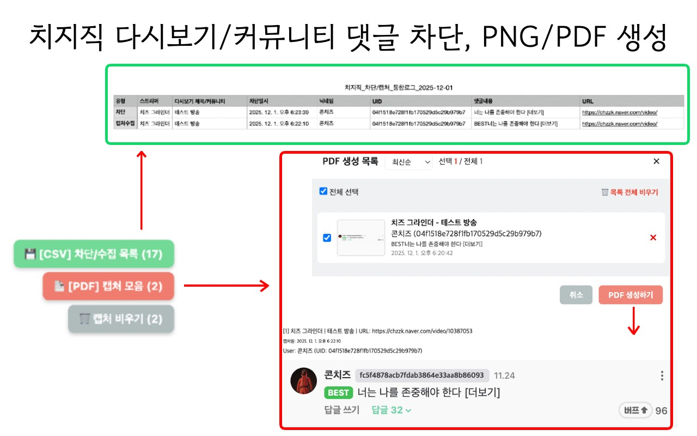
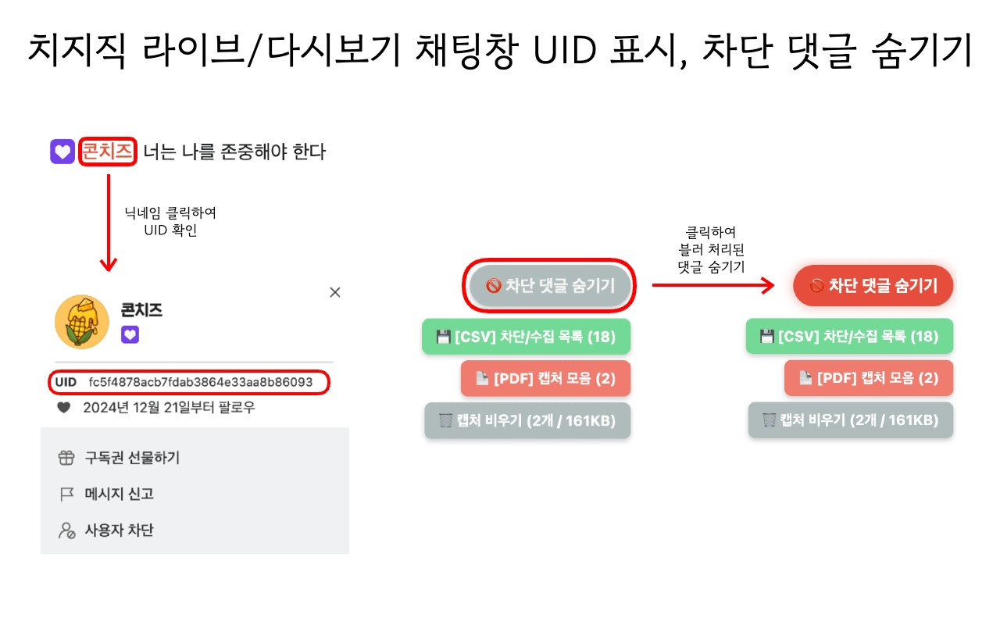

# 🛡️ 치즈 그라인더 (Chzzk-Grinder) - 치지직 악성 댓글 차단 도우미

 

**악성 댓글은 갈아버리세요! UID 확인부터 증거 수집(PDF)까지, 치지직을 더 깨끗하게 즐기는 방법.**

치지직(CHZZK) 라이브 방송, 다시보기와 커뮤니티에서 악성 댓글이나 분탕 유저 때문에 스트레스받으셨나요?
**치즈 그라인더(Chzzk-Grinder)** 는 작성자의 고유 식별자(UID)를 즉시 확인하고, 클릭 한 번으로 차단하며, 향후 신고를 위한 증거 자료(PNG, PDF)까지 손쉽게 만들 수 있도록 도와주는 강력한 클린 시청 도구입니다.

---

## ✨ 주요 기능

### 1. 🕵️‍♀️ 투명한 유저 식별 (UID 표시)

- 모든 댓글 옆에 작성자의 **고유 UID**를 표시합니다.
- 라이브 및 다시보기 채팅창에서도 닉네임을 클릭하면 UID를 바로 확인할 수 있습니다.
- 닉네임을 변경하더라도 UID는 변하지 않아 악성 유저를 끝까지 추적 가능합니다.
- 클릭 한 번으로 UID를 클립보드에 간편하게 복사할 수 있습니다.

  
  
<em>[댓글 섹션] UID 표시, PNG 캡처, 수집함 담기, 차단하기 기능 버튼</em>

### 2. 🚫 원클릭 차단 및 숨김

- 댓글 메뉴에 **'유저 차단/해제'** 버튼을 추가하여 즉시 차단할 수 있습니다.
- 차단된 유저의 댓글은 기본적으로 **블러(Blur)** 처리되어 시야에서 가려집니다.
- 블러 처리된 흔적조차 보기 싫다면, 옵션에서 댓글을 **완전히 숨길 수** 있습니다.
- '더보기' 메뉴에 치지직 사용자 차단 버튼을 추가하여 더욱 손쉽게 차단이 가능합니다.

  
  
<em>[댓글 메뉴] 사용자 차단 및 차단된 댓글 표시 예시</em>

### 3. 🚫 채팅창 유저 즉시 차단 (라이브 + 다시보기)

- 라이브 방송과 **다시보기(VOD)** 채팅창 모두에서 보고 싶지 않은 유저를 바로 차단할 수 있습니다.
- 채팅창 내 닉네임을 클릭하여 **'사용자 차단(치즈 그라인더)'** 버튼을 통해 차단합니다.
- 라이브에서 차단한 유저는 **다시보기 채팅에서도 자동으로 차단**되어 표시되지 않습니다.
- 채팅창 상단의 '더보기' 버튼 안의 **'치즈 그라인더 차단 관리'** 를 통해 채팅창에서 차단한 유저 목록을 쉽게 관리할 수 있습니다.

  
  
<em>[채팅창] 사용자 차단 버튼 및 차단 관리 기능</em>

### 4. 📸 증거 수집 및 채증 (캡처)

- 📷 **즉시 캡처**: 악성 댓글 내용을 깔끔한 이미지(PNG)로 즉시 저장합니다.
- 📥 **수집함 담기**: 여러 개의 악성 댓글을 마치 장바구니에 담듯 한곳에 모아둘 수 있습니다.

_(기능 설명은 위 스크린샷 1번에서 함께 확인할 수 있습니다.)_

### 5. 📂 PDF 및 Excel(CSV) 내보내기

- 수집함에 모아둔 댓글 이미지들을 병합하여 **하나의 PDF 파일**로 깔끔하게 정리해 드립니다.
- 차단한 유저 목록과 수집된 댓글 내역을 데이터화하여 **엑셀(CSV) 파일**로 저장할 수 있습니다.

  
  
<em>[내보내기 관리] PDF 생성 목록, 모달 창 및 실제 PDF 예시</em>

  
  
<em>[채팅창] UID 확인 및 차단 댓글 숨기기 토글 스위치</em>

### 6. 🛠️ 직관적인 차단 내역 관리

- 내가 차단한 유저와 수집한 댓글을 대시보드에서 한눈에 보고 관리할 수 있습니다.
- 리스트의 항목을 클릭하면 해당 댓글이 작성된 원문 페이지로 즉시 이동합니다.

---

## 🔄 업데이트 방법

자동으로 업데이트가 되지 않는다면, 사용 중인 브라우저의 확장 프로그램 관리 페이지에 접속하여 상단의 **'업데이트'** 버튼을 클릭하세요. 최신 버전의 치즈 그라인더를 바로 사용할 수 있습니다.

- **Chrome**: `chrome://extensions/`
- **Edge**: `edge://extensions/`
- **Whale**: `whale://extensions/`
- **Firefox**: `about:addons` 페이지 상단 톱니바퀴 > '업데이트 확인'

---

## 📝 업데이트 내역 (Changelog)

<b>버전 기록 펼쳐보기 (1.1.0 ~ 1.4.0)</b>

 

**[1.4.0 업데이트 내용]**

- 다시보기(VOD) 채팅창에서도 유저를 차단할 수 있어요.
- 라이브 방송에서 차단한 유저는 같은 스트리머의 다시보기 채팅에서도 자동으로 차단돼요.
- 채팅창 차단 버튼이 일부 상황에서 '차단 해제' 상태로 갱신되지 않던 문제를 수정했어요.

**[1.3.0 업데이트 내용]**

- 지금부터 채팅창에서 보고 싶지 않은 유저를 차단할 수 있어요.

**[1.2.2 업데이트 내용]**

- '차단 댓글 숨기기'가 지속적으로 적용되지 않는 버그를 수정했어요.

**[1.2.1 업데이트 내용]**

- 일부 버그를 수정했어요.
- '차단 유저 관리' 모달 창에 '최신순, 오래된순' 정렬 필터를 추가했어요.

**[1.2.0 업데이트 내용]**

- '차단 유저 관리' 모달 창과 'PDF 수집 목록' 모달 창에서 '스트리머' 별로 볼 수 있는 필터를 추가했어요.
- 이제 스트리머 별로 선택하여 CSV, PDF 저장하기가 가능해요.
- 다시보기 페이지에서 오른쪽 하단에 내보내기 버튼이 항상 나타나는 것에서 다시보기 영상이 화면에서 보이지 않을 때만 나타나도록 수정했어요.
- 클립 페이지의 버튼 UI 오류를 수정했어요.
- 클립 페이지에서 유저 차단과 PDF 보관 시, 클립 제목과 스트리머 이름이 나타나지 않는 오류를 수정했어요.
- 클립 페이지의 '클릭하여 라이브 시청' 버튼과 '화살표 네비게이션' 버튼을 영상에 마우스를 올릴 때만 나타나도록 했어요.
- 팔로잉 탭의 라이브 버튼 선택 시, 오른쪽의 정렬 선택 박스의 높이를 수정했어요.

**[1.1.0 업데이트 내용]**

- 라이브/다시보기 채팅창에서 닉네임을 클릭하면 UID를 확인하고 복사할 수 있어요.
- 차단된 댓글의 블러 처리도 싫다면 댓글을 아예 숨길 수도 있어요.

---

본 확장 프로그램은 치지직과 관련이 없으며, 네이버, 치지직, CHZZK은 NAVER㈜의 등록상표입니다. 본 확장 프로그램을 사용하여 발생하는 결과에 대한 모든 책임은 사용자에게 있습니다.
